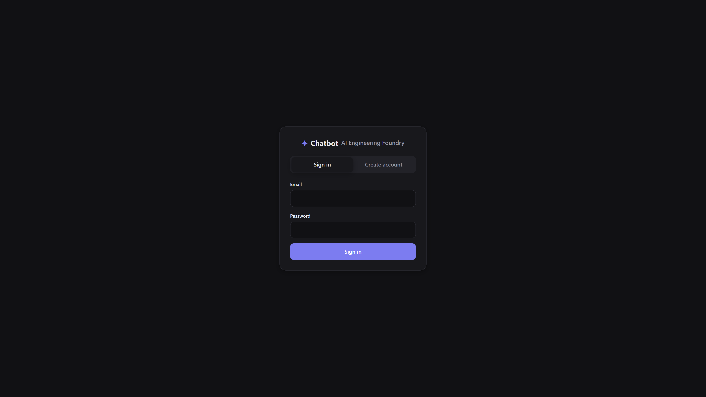
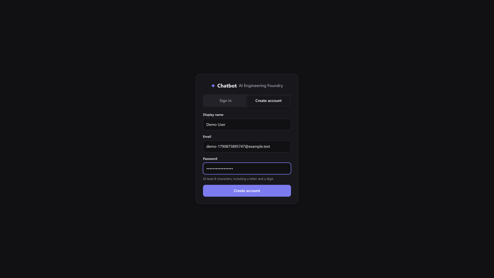
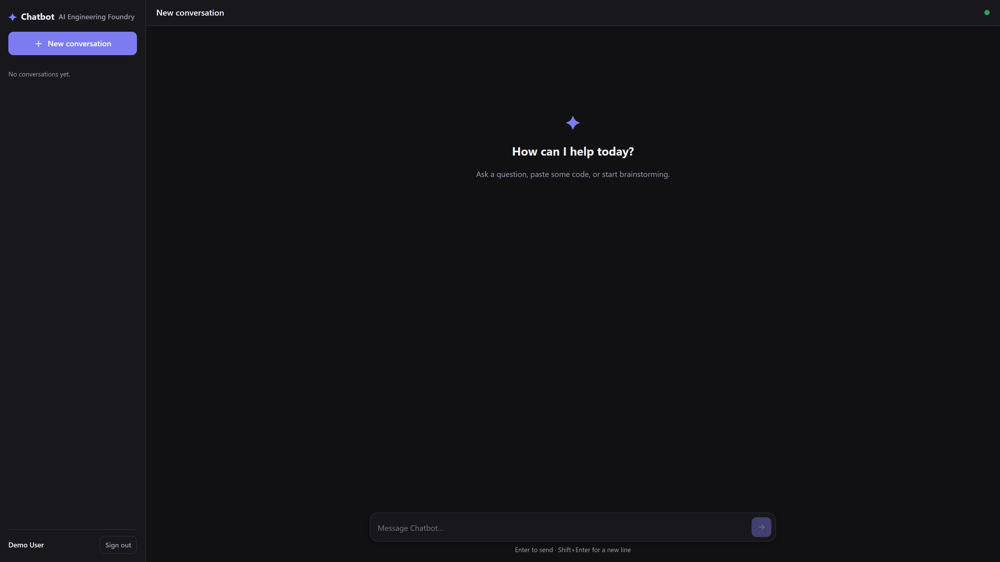
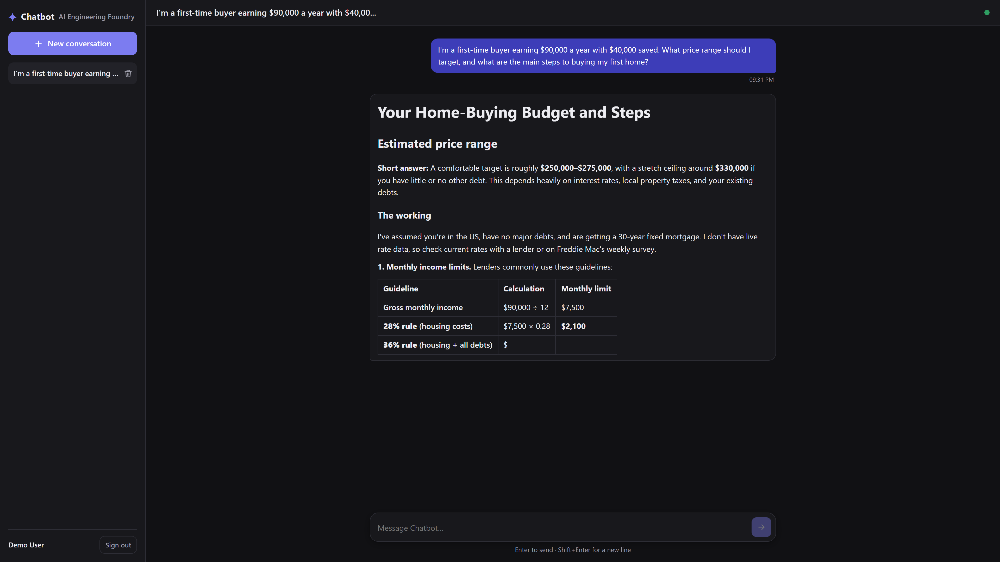
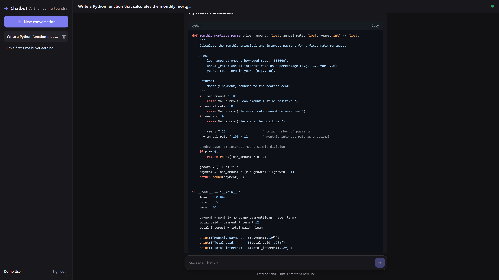
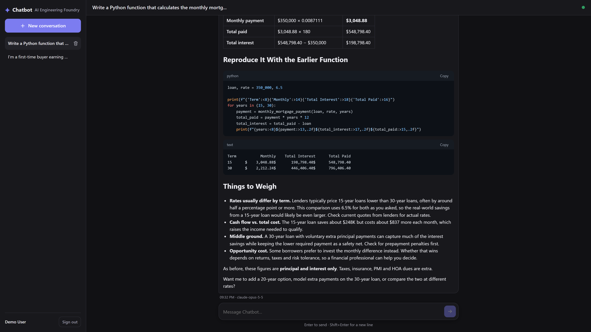
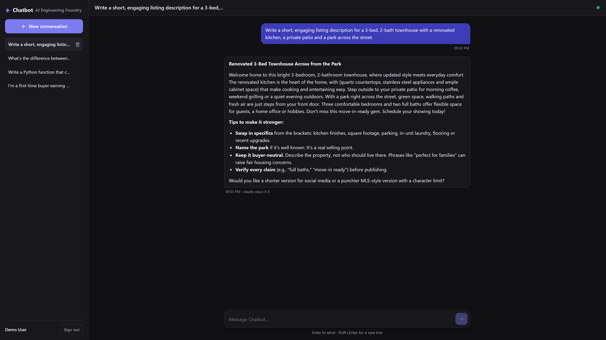
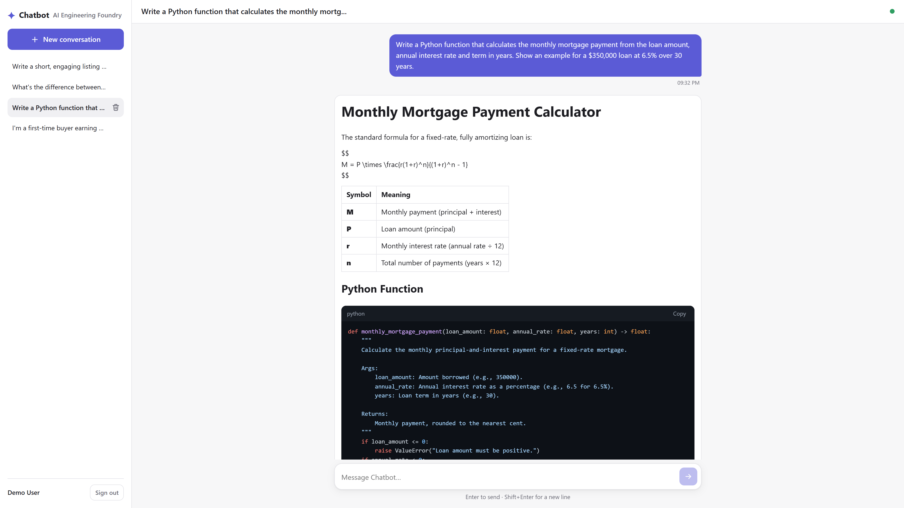
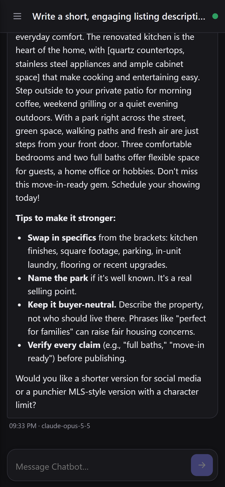
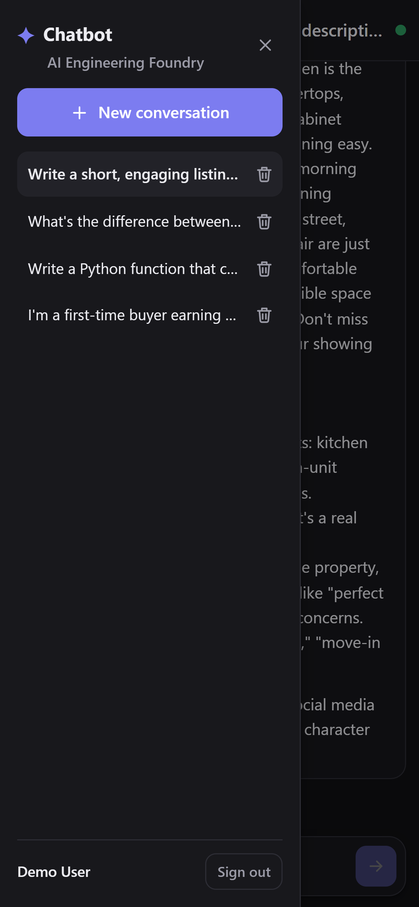

# AI Chatbot with ASP.NET Core

A production-oriented chatbot: ASP.NET Core Web API (.NET 10), EF Core + SQL Server, JWT authentication,
SignalR streaming, and Claude (Anthropic) as the AI provider behind a swappable `IAiChatService` abstraction.
The front end is a Razor Pages app with a vanilla-JS chat client (Markdown, code highlighting, responsive layout).

## Screenshots

Desktop captures are 3840×2160 (1920×1080 at 2×); mobile captures are 1170×2532 (iPhone-size viewport at 3×).

| | |
|---|---|
|  |  |
|  |  |
|  |  |
|  |  |

| Mobile chat | Mobile sidebar |
|---|---|
|  |  |

## Project structure

```text
Chatbot.sln
src/
  Chatbot.Domain/          Entities (User, Conversation, Message) and enums. No dependencies.
  Chatbot.Application/     Use cases (AuthService, ConversationService, ChatService), DTOs, validation,
                           exceptions, and ports: IAiChatService, repositories, IUnitOfWork, ITokenService.
  Chatbot.Infrastructure/  EF Core DbContext + migrations, repositories, JWT + password hashing,
                           AnthropicChatService (official Anthropic SDK), DI registration.
  Chatbot.Api/             Controllers, SignalR ChatHub, Problem Details exception handler,
                           rate limiting, CORS, security headers, health checks.
  Chatbot.Web/             Razor Pages host for the chat UI (wwwroot/js/app.js, wwwroot/css/app.css).
tests/
  Chatbot.UnitTests/         Service/domain tests + Anthropic SDK tests against a fake HTTP handler.
  Chatbot.IntegrationTests/  WebApplicationFactory tests over HTTP and SignalR (SQLite + fake AI).
```

## Architecture decisions

- **Clean architecture.** Dependencies point inward: Api → Infrastructure → Application → Domain. Controllers and the hub
  only translate HTTP/SignalR to application calls; business rules (validation, ownership, history building, titles)
  live in `Chatbot.Application`.
- **AI behind an abstraction.** `IAiChatService.GenerateResponseAsync(history, onDelta, ct)` streams text via a callback
  and returns the full result with usage metadata. `AnthropicChatService` implements it with the official `Anthropic`
  NuGet SDK; swapping providers means adding one class and one DI line. Tests use a fake implementation.
- **Always stream from the provider.** Long answers never hit HTTP timeouts, and the same code path serves both the
  streaming hub and the plain `POST /api/chat` endpoint.
- **Refusal handling.** The model can decline a request (`stop_reason: "refusal"`). The service opts into the API's
  server-side fallback (`fallbacks: "default"`, beta `server-side-fallback-2026-07-01`) so a declined turn is retried on
  a fallback model; if it still declines, a polite notice is returned instead of a partial answer.
  Disable with `Anthropic:EnableRefusalFallback=false`.
- **User message is persisted before the AI call.** A provider outage never loses what the user typed. When the next
  request is built, consecutive same-role turns are merged so the transcript stays valid for the provider.
- **Ownership by query.** Repositories only load conversations with `UserId == currentUser`; other users' data looks
  like a 404, so IDs cannot be probed.
- **SignalR for real time.** `ChatHub.SendMessage` pushes `UserMessageSaved` and `ReceiveDelta` events and completes
  with the final `ChatResponse`. If the client disconnects, generation is cancelled and any partial reply is saved.
  The UI reconnects automatically and falls back to `POST /api/chat` while the hub is unavailable.
- **Problem Details everywhere.** `GlobalExceptionHandler` maps application exceptions to RFC 9457 responses
  (400/401/404/409/429/502/503); unexpected errors become a generic 500 without internal details.

## API

| Method | Route | Description |
|---|---|---|
| POST | `/api/auth/register` | Create account → JWT |
| POST | `/api/auth/login` | Sign in → JWT |
| GET | `/api/auth/me` | Current user |
| POST | `/api/chat` | Send a message (`conversationId` optional → new conversation); returns both messages |
| GET | `/api/conversations` | Current user's conversations (most recent first) |
| GET | `/api/conversations/{id}` | Conversation with messages |
| POST | `/api/conversations` | Create an (optionally titled) conversation |
| DELETE | `/api/conversations/{id}` | Delete a conversation and its messages |
| WS | `/hubs/chat` | SignalR hub: invoke `SendMessage({conversationId, message})` |
| GET | `/health` | Health check (includes database) |

All endpoints except register/login/health require `Authorization: Bearer <token>`
(SignalR passes it as the `access_token` query parameter).

## Prerequisites

- .NET SDK 10
- SQL Server (LocalDB, Express, Developer or Azure SQL)
- `dotnet-ef` tool: `dotnet tool install --global dotnet-ef`
- An Anthropic API key (https://console.anthropic.com)

## Configuration

Settings are bound with the Options pattern and validated at startup. Any value can be overridden with an
environment variable using `__` as the section separator (e.g. `Anthropic__ApiKey`).

| Setting | Purpose |
|---|---|
| `ConnectionStrings:DefaultConnection` | SQL Server connection string |
| `Database:Provider` | `SqlServer` (default) or `Sqlite` |
| `Database:MigrateOnStartup` | Apply migrations at startup (true in Development) |
| `Jwt:Issuer`, `Jwt:Audience` | Token issuer/audience |
| `Jwt:SigningKey` | **Secret.** ≥ 32 chars. Use user-secrets / env var / key vault |
| `Anthropic:ApiKey` | **Secret.** Falls back to the `ANTHROPIC_API_KEY` env var |
| `Anthropic:Model` | Default `claude-opus-5-5` |
| `Anthropic:MaxTokens`, `Anthropic:Effort` | Output cap and reasoning effort (`low`…`max`) |
| `Anthropic:SystemPrompt` | System prompt for every conversation |
| `Chat:MaxMessageLength`, `Chat:MaxHistoryMessages` | Input limit and context window (messages) |
| `Cors:AllowedOrigins` | Front-end origins allowed to call the API |
| `RateLimiting:*` | Per-minute limits: global, chat (per user), auth (per IP) |
| `RequestLimits:*` | Max HTTP body and SignalR message sizes |
| `Frontend:ApiBaseUrl` (Chatbot.Web) | Public URL of the API used by the browser |

Example environment configuration (placeholders):

```powershell
$env:ConnectionStrings__DefaultConnection = "Server=myserver;Database=ChatbotDb;User Id=chatbot;Password=<password>;Encrypt=True"
$env:Jwt__SigningKey  = "<random 48+ character secret>"
$env:Anthropic__ApiKey = "sk-ant-<your-key>"
$env:Cors__AllowedOrigins__0 = "https://chat.example.com"
```

Secrets are never committed: `appsettings.json` contains placeholders only.

## Local setup

```powershell
# 1. Secrets for the API (stored outside the repo by dotnet user-secrets)
dotnet user-secrets set "Jwt:SigningKey" "<random 48+ character secret>" --project src/Chatbot.Api
dotnet user-secrets set "Anthropic:ApiKey" "sk-ant-<your-key>" --project src/Chatbot.Api

# 2. Database (the Development connection string targets localhost with Windows auth; edit
#    src/Chatbot.Api/appsettings.Development.json if your server differs)
dotnet ef database update --project src/Chatbot.Infrastructure --startup-project src/Chatbot.Api

# 3. Run API and front end (two terminals)
dotnet run --project src/Chatbot.Api --launch-profile https   # https://localhost:7094
dotnet run --project src/Chatbot.Web --launch-profile https   # https://localhost:7187
```

Open https://localhost:7187, create an account and start chatting. In Development the API also applies pending
migrations on startup.

### EF Core migration commands

```powershell
# Add a migration after changing entities/configurations
dotnet ef migrations add <Name> --project src/Chatbot.Infrastructure --startup-project src/Chatbot.Api --output-dir Persistence/Migrations

# Apply migrations
dotnet ef database update --project src/Chatbot.Infrastructure --startup-project src/Chatbot.Api

# Generate an idempotent SQL script for production deployment
dotnet ef migrations script --idempotent --project src/Chatbot.Infrastructure --startup-project src/Chatbot.Api -o migrate.sql
```

The design-time factory reads `ConnectionStrings__DefaultConnection` from the environment when set.

## Tests

```powershell
dotnet test
```

- Unit tests cover the services (validation, ownership, history building, streaming, cancellation, AI failure),
  domain logic, and `AnthropicChatService` against a fake HTTP handler (request shape, SSE parsing, refusal handling,
  error mapping).
- Integration tests host the real API in memory with SQLite and a fake AI provider: authentication/authorization,
  conversation CRUD and isolation between users, chat over REST and SignalR, validation, Problem Details,
  AI outages (503), request size limits, rate limiting, CORS and security headers.

No test calls the real AI provider.

## Security summary

- JWT bearer auth (HMAC-SHA256, validated issuer/audience/lifetime); passwords hashed with ASP.NET Core Identity's PBKDF2 hasher.
- A fallback authorization policy requires authentication on every endpoint unless explicitly anonymous.
- Input validation in the application layer; request body limit (Kestrel + Content-Length guard) and SignalR message limit.
- Rate limiting: global per user/IP, per-user chat limit shared by REST and SignalR, per-IP auth limit.
- CORS restricted to configured origins; HTTPS redirection + HSTS outside Development; `nosniff`, `DENY` framing,
  no-referrer headers; strict Content-Security-Policy on the front end; AI Markdown sanitized with DOMPurify.
- Logs record IDs, token counts and error types, never message content, passwords, tokens or API keys.

## Deployment

1. Provision SQL Server and apply the idempotent migration script (or run `dotnet ef database update` from CI).
2. Publish both apps: `dotnet publish src/Chatbot.Api -c Release -o out/api` and `dotnet publish src/Chatbot.Web -c Release -o out/web`.
3. Host behind HTTPS (Azure App Service, IIS, containers, etc.). Configure the API with
   `ConnectionStrings__DefaultConnection`, `Jwt__SigningKey`, `Anthropic__ApiKey`, `Cors__AllowedOrigins__0`,
   and set `Frontend__ApiBaseUrl` on the web app. Store secrets in a secret manager (e.g. Azure Key Vault).
4. Enable WebSockets on the host for SignalR. When scaling the API out to several instances, add a SignalR backplane
   (Azure SignalR Service or Redis) and sticky sessions, and move rate limiting to a distributed store.
5. Point load-balancer health probes at `/health`.
